# UEHMI

**Unreal Engine Human Machine Interface**

UEHMI is a fully integrated Unreal Engine plugin designed to simplify human × machine interaction while running entirely offline. It provides a pipeline for conversational AI, speech processing, and expressive character interaction.


## Demo

[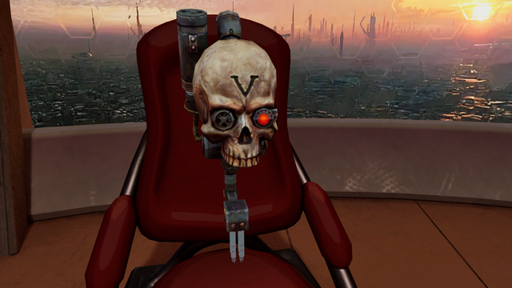](https://youtu.be/aBnHtudsks8)


<details>
<summary>Table of Contents</summary>
<ol>
	<li><a href="#requirements">Requirements</a></li>
	<li><a href="#dependencies">Dependencies</a></li>
	<li><a href="#features">Features</a></li>
	<li><a href="#setup">Setup</a></li>
	<li><a href="#api-overview">API Overview</a></li>
</ol>
</details>


## Requirements

- UE 5.4 - 5.7
- Platforms: Win64


## Dependencies

- ggml
	- llama.cpp
	- whisper.cpp
- onnxruntime
	- sherpa-onnx
	- piper
- cld2
- OVRLipSync
- OpenCV

*(all dependencies are optional)*

## Features

- LLM chat
	- llama.cpp
	- OpenAI chat completions
- Speech to text
	- whisper.cpp
	- sherpa-onnx
- Text to speech
	- piper
	- sherpa-onnx
	- Elevenlabs
- Language detection
	- cld2
- Lip sync
	- OVRLipSync (sil, PP, FF, TH, DD, kk, CH, SS, nn, RR, aa, E, ih, oh, ou)
	- Remap to metahuman or custom mesh
- Facial expression recognition
	- OpenCV FER+ (neutral, happiness, surprise, sadness, anger, disgust, fear, contempt)


## Setup

* Create UE C++ project
* Copy plugin to ProjectName/Plugins/HMI
* Configure deps: ProjectName/Plugins/HMI/Source/HMIBackend/HMIBackend.Build.cs
* Modify ProjectName/ProjectName.uproject
	```
	"Plugins": [
		{
			"Name": "HMI",
			"Enabled": true
		},
		{
			"Name": "OpenCV",
			"Enabled": false
		},
		{
			"Name": "NNERuntimeORT",
			"Enabled": false
		},
		{
			"Name": "NNEDenoiser",
			"Enabled": false
		}
	]
	```
* Add to ProjectName/Config/DefaultEngine.ini
	```
	[Voice]
	bEnabled=True
	```
* Add to ProjectName/Config/DefaultGame.ini
	```
	[/Script/Engine.GameSession]
	bRequiresPushToTalk=False
	```


## API Overview

<details>
<summary>Pipeline: Record > STT > Prompt</summary>

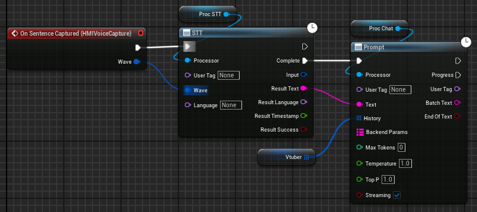

</details>

<details>
<summary>Pipeline: TTS > LipSync > Play</summary>

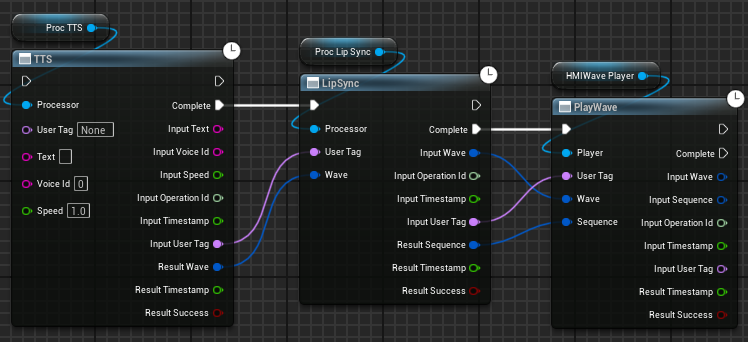

</details>

<details>
<summary>LLM chat</summary>

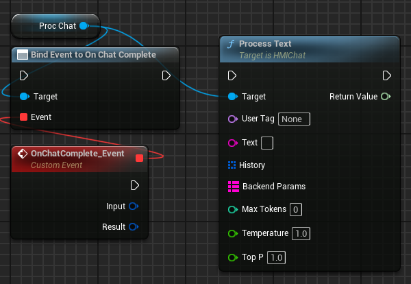

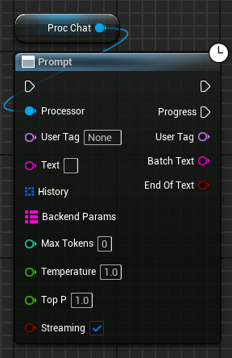

</details>

<details>
<summary>Speech to text</summary>

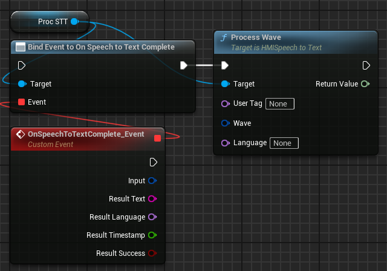

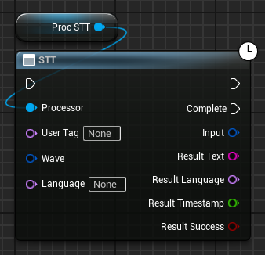

</details>

<details>
<summary>Text to speech</summary>

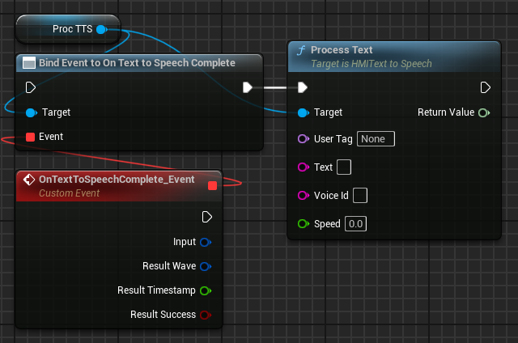

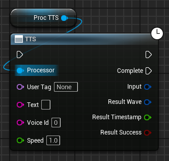

</details>

<details>
<summary>Lip sync</summary>

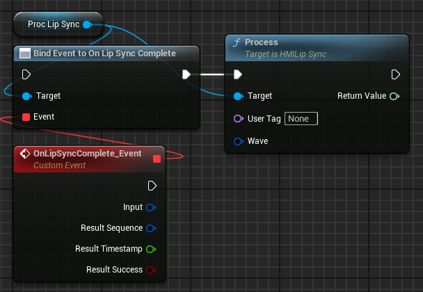

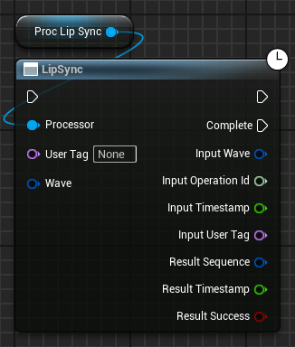

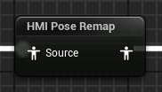

</details>

<details>
<summary>Facial expression recognition</summary>

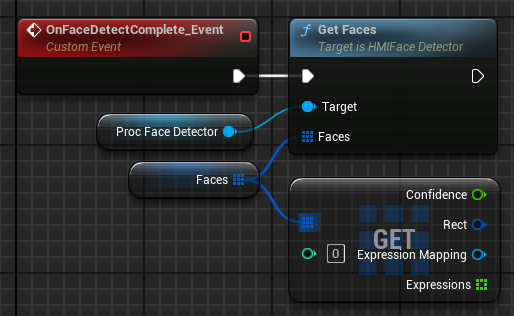

</details>
